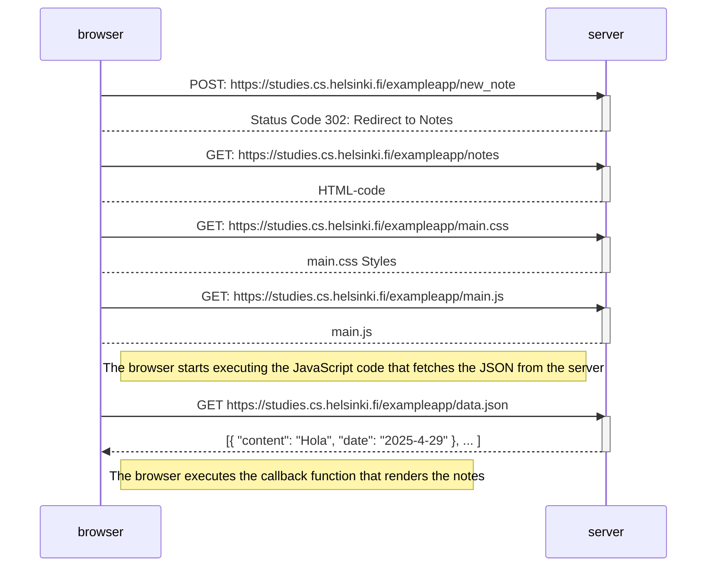

```mermaid
sequenceDiagram
    participant browser
    participant server

    browser->>server: POST: https://studies.cs.helsinki.fi/exampleapp/new_note 
    activate server
    server-->browser: Status Code 302: Redirect to Notes
    deactivate server
    
    browser->>server: GET: https://studies.cs.helsinki.fi/exampleapp/notes 
    activate server
    server-->browser: HTML-code 
    deactivate server
    
    browser->>server: GET: https://studies.cs.helsinki.fi/exampleapp/main.css 
    activate server
    server-->browser: main.css Styles
    deactivate server

    browser->>server: GET: https://studies.cs.helsinki.fi/exampleapp/main.js 
    activate server
    server-->browser: main.js
    deactivate server

    Note right of browser: The browser starts executing the JavaScript code that fetches the JSON from the server

    browser->>server: GET https://studies.cs.helsinki.fi/exampleapp/data.json
    activate server
    server-->>browser: [{ "content": "Hola", "date": "2025-4-29" }, ... ]
    deactivate server

    Note right of browser: The browser executes the callback function that renders the notes


```