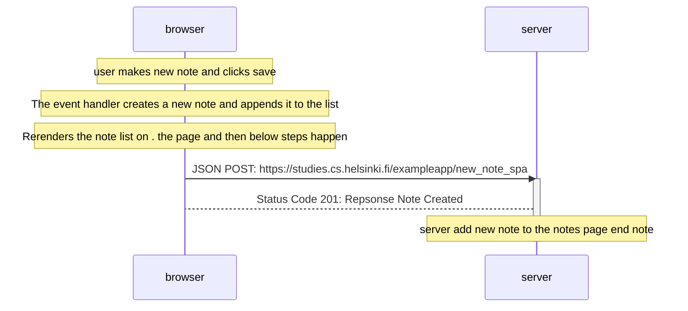

```mermaid
sequenceDiagram
    participant browser
    participant server

    note over browser: user makes new note and clicks save
    note over browser: The event handler creates a new note and appends it to the list
    note over browser: Rerenders the note list on . the page and then below steps happen

    browser->>server: JSON POST: https://studies.cs.helsinki.fi/exampleapp/new_note_spa 
    activate server
    
    server-->browser: Status Code 201: Repsonse Note Created
    note over server: server add new note to the notes page end note
    deactivate server
    
    
    


```